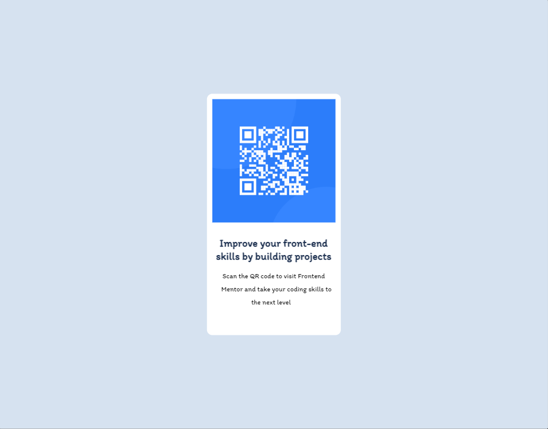
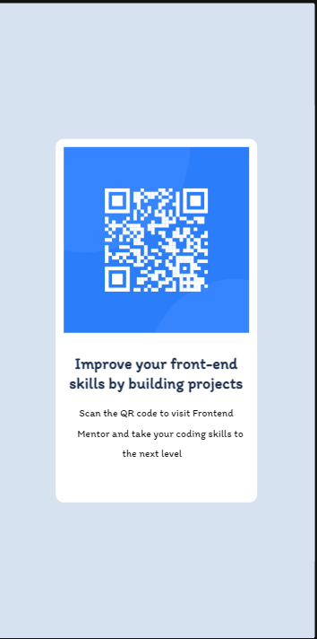

# Qr Code

## Visualização em desktop

 

## Visualização dispositivos móveis

(Pressione CTRL + clique para visualizar o projeto em uma nova guia)

## Linguagens utilizadas
- HTML
- CSS

Meu primeiro projeto realizado, usando como base o desafio inicial do site FrontEnd Mentor.
